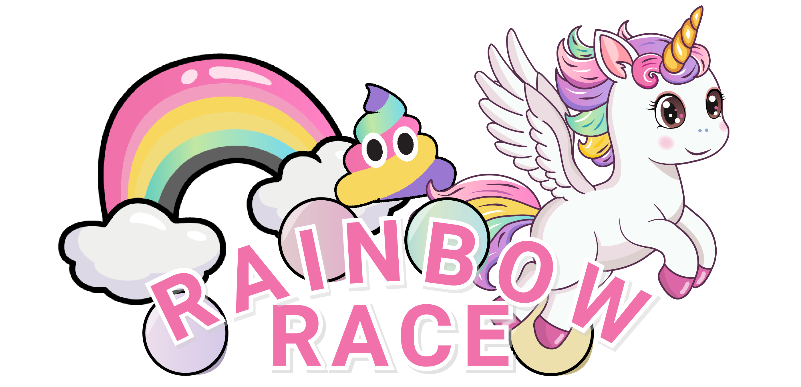

<div align="center">


# Rainbow Racer V2 — Prism Rush 🦄🌈

**Fly. Graze. Combo. Beat your ghost.**

A fast arcade flier for the browser — the full-power sequel to my first-ever
bootcamp game, rebuilt with Next.js, TypeScript and a custom Canvas engine.

</div>

## Play

```bash
npm install
npm run dev
```

Open http://localhost:3000, type your name, hit **JOUER**.

## Controls

| Input | Action |
|---|---|
| `Space` (tap) | Flap wings |
| `Space` (hold) | Glide — slow fall, thread the needles |
| `Shift` | Dash — brief invincibility, plow through clouds |
| `B` | Cacalicorne Bomb 💩 — wipes every cloud on screen |
| `Esc` / `P` | Pause |
| Touch | Tap = flap · hold = glide · double-tap = dash |

## Game mechanics

- **Combo & multiplier** — every pickup raises your combo; every 6 combo = +1× score
  multiplier (up to ×8). Getting hit resets it. Risk stays interesting forever.
- **Near-miss bonus** — grazing a cloud without touching it pays points. Skill is rewarded.
- **Rainbow Rush** — catch a rainbow: 7s of invincibility, gem magnet, ×2 score,
  and the sky goes full disco.
- **Cacalicorne Bomb** — collect 25 gems to charge the legendary unicorn poop.
- **Living world** — biomes shift with distance (Crystal Cloudscape → Sunset Drift →
  Neon Abyss → Stardust Sanctuary), each unlocking new enemy behaviours:
  sine-weaving clouds, altitude-homing clouds, cloud-wall gates.
- **Ghost racing** — your best run is recorded and replayed as a translucent ghost.
  Beat yourself first, then beat the world.
- **Global leaderboard** — one shared top-100, name required, trash talk optional.

## Architecture

```
game/        Canvas engine — zero React inside the loop
  engine.ts            main loop, physics, collisions, scoring, HUD
  spawner.system.ts    pattern-based procedural waves, difficulty-scaled
  entities.ts          clouds / gems / stars / rainbows / hearts
  particles.system.ts  pooled particles (no GC churn)
  background.system.ts parallax + biome color blending
  ghost.ts             best-run recording & replay
  input.manager.ts     keyboard + touch, edge/level triggered
  audio.manager.ts     overlapping SFX + music channel
  constants.ts         every tuning value in one file
components/GameShell.tsx   React shell: menu / HUD overlays / game over
app/api/leaderboard/route.ts  leaderboard API (file store or Supabase)
```

The engine runs on `requestAnimationFrame` with delta-time physics, auto-pauses on
tab blur, and renders to a fixed 1280×720 canvas scaled with CSS.

## Global leaderboard (production)

Out of the box scores are stored in `.data/leaderboard.json` — great locally, but
ephemeral on serverless hosts. For a real shared leaderboard, create a free
[Supabase](https://supabase.com) project and run:

```sql
create table scores (
  id bigint generated always as identity primary key,
  name text not null,
  score int not null,
  distance int not null,
  max_combo int not null,
  created_at timestamptz default now()
);
```

Then set the env vars from `.env.example` (locally and on Vercel) — the API
switches backends automatically. Deploy with `vercel`.

## Credits

Art & sounds from Rainbow Racer V1 (Ironhack bootcamp, module 1) — designed for
my unicorn-obsessed daughter. V2 engine built with Claude.
